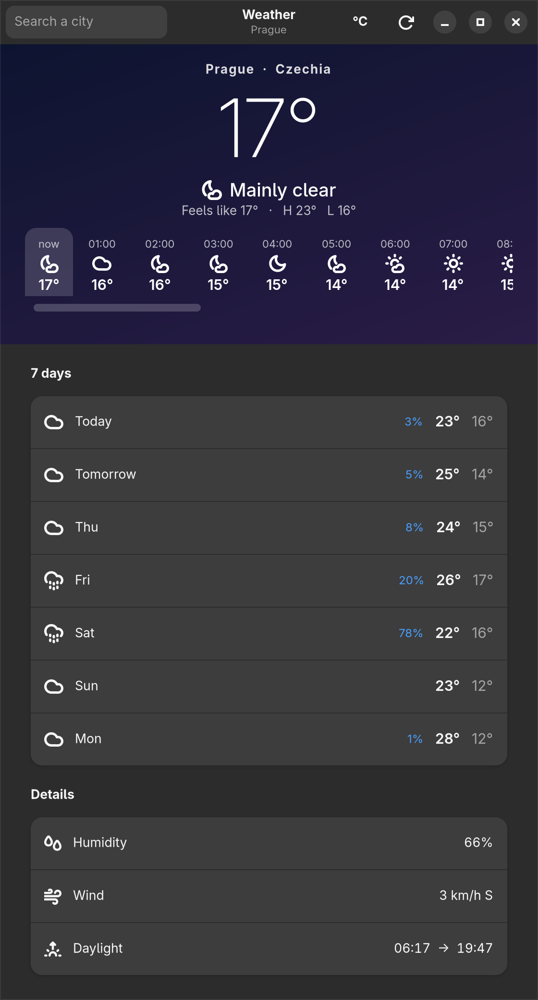
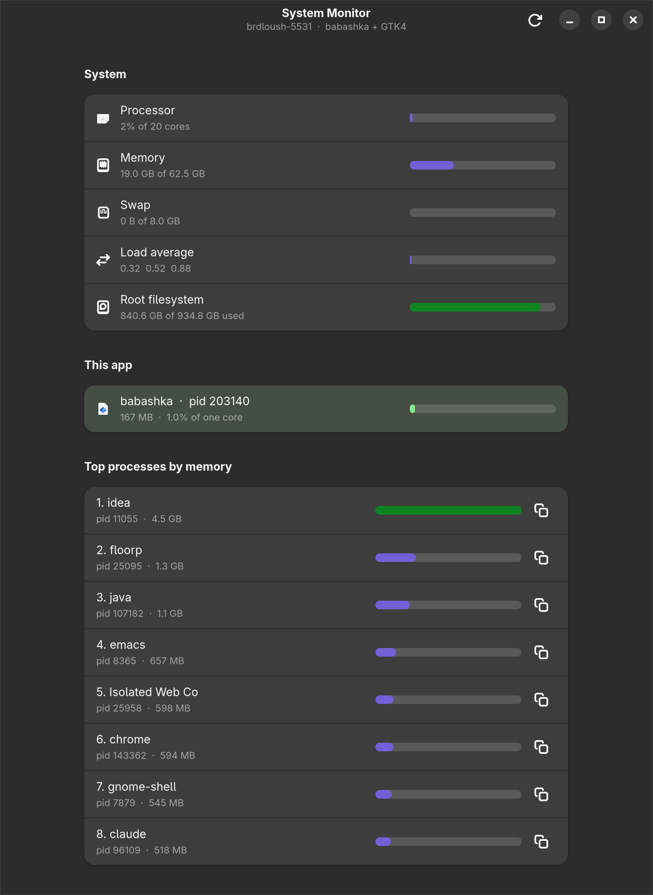

# bb-gtk-ffi-gui

A tiny proof of concept: **reactive, hiccup-style native GUIs in
[babashka](https://babashka.org), on GTK4, through `babashka.ffi`.**

Same idea as [glimmer-ui](https://yogthos.net/posts/2026-08-29-glimmer-ui.html)
(Reagent-style reactive atoms driving real native widgets), but using babashka's
new [FFI](https://blog.michielborkent.nl/babashka-ffi.html) instead of Jolt.

No JVM, no build step, no bindings to generate. `bb counter` and a native
window appears.

## The pretty ones

Two examples do the arguing. Both render their own screenshots, at the display's
full pixel density, via `bb shot`.

### Weather

`bb weather` -- Open-Meteo, so there is no API key and nothing to sign up for.



The colour is the point: weather code plus day/night picks one of 14 gradients,
and changing conditions only swaps a CSS class. Big light type, an hourly strip
that scrolls, a 7-day list, and a details group.

It **idles at 0.00% of a core**, 170 MB. It refreshes every 15 minutes, so the
blocking main loop genuinely does nothing in between. Works offline too: the
last response is cached, so the window opens with real content and an honest
banner saying how old it is.

`examples/weather.clj` is the UI, `examples/openmeteo.clj` the data, and
`examples/weather_css.clj` the stylesheet -- kept apart because it is the whole
reason the app looks designed rather than assembled.

### System monitor

`bb monitor` -- a libadwaita dashboard reading `/proc`, live:



Look at the row it highlights. An idle window built this way costs **0.00% of a
core**; the monitor measures 1.5% over eight seconds, and all of that is its own
work -- it re-reads `/proc` and repaints fourteen rows every second. The figure
in the picture is a live one-second sample, so it jitters between 1 and 3%. Next
to it is a JetBrains IDE using 4.5 GB.

The UI is one pure function of one map. `examples/monitor.clj` is 167 lines,
`examples/sysinfo.clj` (all the `/proc` reading) is 215, and the libadwaita
bindings are 279. Core did not have to change much to allow it -- see
[Extension points](#extension-points) and `plan/beautiful-app.md`.

### Keeping it small

239 MB down to 162, in two steps:

| | saves | how |
| --- | --- | --- |
| `GSK_RENDERER=cairo` | ~47 MB | these UIs are lists, type and gradients; nothing needs a GPU, and not mapping the GL/mesa stack is free money. Output is pixel-identical. Set from inside the process in `monitor/lean!` and `weather/lean!`, so it holds however you launch it. |
| `-Xmx96m` | ~30 MB | bb is a GraalVM native image and **does** honour `-Xmx`. It has to be on the command line, so the app tasks re-exec babashka with it -- via `babashka.process/exec`, so it stays one process. |

`-Xmx64m` works too and saves another 7 MB, but 96 leaves headroom; below about
48 MB the app dies on startup. The remaining ~160 MB is mostly the babashka
binary itself (63 MB resident doing nothing) plus GTK and its theme.

## The counter

```clojure
(ns counter
  (:require [gtk.core :as ui]
            [gtk.ratom :as r]))

(defn counter []
  (let [n (r/atom 0)]
    (fn []
      [:vbox {:spacing 12 :margin 16}
       [:label "Count: " @n]
       [:hbox {:spacing 8}
        [:button {:label "- 1" :on-click #(swap! n dec)}]
        [:button {:label "+ 1" :on-click #(swap! n inc)}]
        [:button {:label "reset" :on-click #(reset! n 0)
                  :sensitive (not= 0 @n)}]]])))

(defn -main [& _]
  (ui/run (counter) :title "counter" :width 320 :height 160))
```

## Run it

```bash
bb weather    # the Open-Meteo weather app
bb monitor    # the libadwaita system monitor
bb counter    # the glimmer counter
bb todo       # dynamic list, entry, check buttons

bb shot weather   # regenerate a screenshot (the app shoots itself)
bb shot monitor
bb test       # all thirteen test files (see Tests below)
bb dev        # nREPL server on 1667, for editor-driven work

bb tasks      # list them
```

Needs babashka >= 1.13.220 and GTK4 (`libgtk-4.so.1`). `bb weather` and
`bb monitor` also need libadwaita (`libadwaita-1.so.0`, 1.9 here) and reads `/proc`, so it is
Linux-only. `bb weather` needs the network on first run only. Both re-exec
babashka with `-Xmx96m`, for the reason in [Keeping it small](#keeping-it-small).

## REPL workflow

You can keep the window open and reshape it while it runs. Two kinds of change,
and they behave differently.

**State changes are automatic.** That is the whole point of the reactive atom:
its watch marks the tree dirty, the loop notices, and only the props that
actually changed get pushed into GTK.

**Code changes are not, on their own.** Redefining a function touches no atom,
so nothing marks the tree dirty and the window keeps showing the old render,
even though the new code is already loaded.

Turn on one of the [dev helpers](#dev-helpers) and that goes away -- they watch
the vars, or just re-render on a timer. The rest of this section is what happens
*without* them, which is worth knowing because it explains what those helpers
are actually doing.

You do *not* need `#'home` for this. A plain call like `(home state)` resolves
through the var at call time in babashka, exactly as on the JVM, so a redef is
picked up on the next render. All that is missing is the render.

So a redef sits pending until *something* re-renders. Type into an entry, tick a
checkbox, click a button -- the resulting `swap!` marks the tree dirty, and the
very next render already uses your new code. `ui/refresh!` is just "re-render
now, without touching the UI".

### Setting it up

Structure the app so the view is a plain fn of state:

```clojure
(defn home [state]
  [:vbox {:spacing 10 :margin 16}
   [:label "items: " (count (:items @state))]
   ...])

(defn app []
  (let [state (r/atom {:draft "" :items []})]
    (fn [] (home state))))
```

`run` blocks, so start it on its own thread and keep the handle:

```clojure
(def app-thread (future (ui/run (app) :title "todo" :width 420 :height 320)))
```

Now edit `home`, re-evaluate just that form, and:

```clojure
(ui/refresh!)
```

The window repaints in place. Widgets are patched, not rebuilt, so focus and
the caret in a half-typed entry survive.

That `refresh!` is the step the [dev helpers](#dev-helpers) remove. One
`(dev/auto-refresh!)` at the start of a session and you never type it again.

### Inspecting and stopping

```clojure
(:window @ui/current)                 ; the live GtkWindow pointer
(-> @ui/current :tree :children)      ; the reconciled tree

(ui/close!)                           ; shut the window, let the loop return
```

`ui/close!` is the clean way out: it asks the loop to stop, and the window is
destroyed by the loop itself on the thread GTK expects. `future-cancel` also
tears the window down now -- it interrupts the loop, and `run`'s `finally` still
runs -- but it stops at an arbitrary point, so prefer `close!`. Closing the
window with the mouse ends the loop too.

### Threads

Every GTK call happens on the thread that ran `gtk_init` -- the future's thread
-- which is what GTK requires, and `(:thread @ui/current)` records which one it
is.

`refresh!`, `close!` and `swap!` are safe from any thread: they set a flag and
call `g_main_context_wakeup`, both of which are safe off-thread. The render and
the teardown happen back on the GTK thread.

Anything else that touches widgets must get over there itself. `dev/later!`
does that via `g_idle_add`, and `dev/on-gtk-thread!` waits for the result:

```clojure
(future
  (let [rows (slow-query)]                    ; off-thread is fine
    (dev/later! #(reset! state rows))))       ; widgets only over there
```

Calling a widget function from the wrong thread does not raise -- it segfaults.
`dev/screenshot!` marshals itself for exactly this reason.

### Gotchas

- Calling a fn never captures it, so redefining works. Passing it as a **value**
  does capture: `(def v home)` or `(map home xs)` freeze the fn as it is now.
- Re-evaluating `(ui/run (app) ...)` calls `(app)` again, which builds a **fresh**
  `r/atom`, so your state resets. To keep state across restarts, move it to a
  top-level `defonce`.
- One window at a time. `ui/current` is a single atom, so `refresh!` and `close!`
  act on the most recently started window.

`test/repl_reload_test.clj` drives this whole loop end to end -- redefines a view,
calls `refresh!`, then reads the text back out of the real `GtkLabel`:

```
1) initial: old 7
2) after swap!, no refresh needed: old 8
3) after redef, before refresh! (stale, as expected): old 8
4) after ui/refresh!: NEW 8 123
```

## Dev helpers

`gtk.dev` removes the manual `refresh!`. Four mechanisms; pick one, or compose
them. Nothing here is needed at runtime.

| | what it catches | you must | cost |
| --- | --- | --- | --- |
| `(dev/auto-refresh!)` | everything | keep views pure | ~0.3% of a core |
| `(dev/watch-ns! 'todo)` | fns already interned when it ran | re-run it after adding a fn | none |
| `(dev/defview home [st] ...)` | that one var | use `defview` instead of `defn` | none |
| `(dev/watch-files! "src" "examples")` | anything saved to disk | `defonce` for state | one stat per file, every 300ms |

```clojure
(require '[gtk.dev :as dev])

(dev/auto-refresh!)        ; re-render on a timer. no registration at all
(dev/watch-ns! 'todo)      ; event-driven, no wasted renders
(dev/watch-files! "src")   ; edit and save, no REPL attached

(dev/status)               ; what is running
(dev/stop!)                ; stop all of it (leaves the window up)
```

### auto-refresh!

Re-renders on a timer whether anything changed or not. A no-op re-render of ~90
widgets measures **0.28 ms**, so at the default 100 ms interval this is well
under 1% of a core, and the dirty flag was never buying much.

Nothing to register and nothing to remember. It catches a redefined view, a
redefined nested component, a whole namespace reload, a changed top-level value.

The one rule: **views must be pure.** They now run 10 times a second, so a
`println` or a `swap!` inside one fires continuously.

### watch-ns! and defview

Babashka vars support `add-watch`, and a plain `(defn home ...)` redef fires it --
repeatedly, because the watch survives the redef. So these are event-driven: no
polling and no wasted renders.

`watch-ns!` arms every fn currently interned in a namespace. A fn you define
*afterwards* is not covered, since there was nothing to watch at the time. Either
re-run it, or declare views with `defview`, which arms itself:

```clojure
(dev/defview home [state]
  [:vbox {} [:label "items: " (count (:items @state))]])
```

The ordering works out: a redef fires the watch armed by the previous definition,
then re-arms under the same key. So the first eval arms it, and every later eval
both refreshes and re-arms. Forget `defview` on one view and that view silently
stops live-updating -- which is the trade against `auto-refresh!`.

### watch-files!

Polls `.clj` mtimes, `load-file`s what changed, then re-renders. The only option
that needs no REPL: save in your editor and the window updates. A syntax error in
a half-saved file is reported and the watcher keeps going.

`load-file` re-runs the file's top-level forms, so a top-level `(def state
(r/atom ...))` is rebuilt on every save. Use `defonce`, or keep state inside the
fn `run` closes over -- which is what the todo example does, so its items survive
a save. Keep `ui/run` out of the top level or a save opens a second window.

`test/dev_test.clj` drives all four against a live window and reads the results
out of the real `GtkLabel`.

## When a view is broken

A typo in a view -- a stray string, a misspelled widget -- used to freeze the
window. The exception escaped `render!`, escaped the main
loop, and killed the thread. Nothing pumped GTK after that, so the window sat
there unresponsive, and because it died inside a `future` the error was
swallowed: no message at all. `ui/close!` could not help either, since the loop
that destroys the window was gone.

Now a failed render is contained. The window keeps pumping, the last good render
stays on screen, and the error is printed:

```
[gtk] render failed: :vbox has no text of its own: ["oops"]
  put the text in a child, e.g. [:vbox {} [:label "oops"]]
       {:tag :vbox, :texts ["oops"]}
```

Fix the view, re-render, and it recovers. Nothing to restart.

Three things make that work:

- **`normalize` validates the whole tree before `reconcile` touches a widget**,
  so a malformed view is rejected without half-mutating the window.
- **Event handlers are wrapped**, so an exception in your `:on-click` is reported
  instead of crossing back into C, where behaviour is undefined.
- **Errors are deduplicated.** With `dev/auto-refresh!` running, a broken view
  would otherwise print ten times a second.

The last failure is kept in `gtk.core/last-error` and on `(:error @ui/current)`,
and clears on the next good render. `test/error_recovery_test.clj` covers a bad
child, an unknown widget, recovery, and a throwing handler.

## How it works

Three small namespaces, plus two optional ones:

| File | Lines | Job |
| --- | --- | --- |
| `src/gtk/ffi.clj` | 90 | `defcfn` bindings for the 52 GTK4/GObject symbols core uses |
| `src/gtk/ratom.clj` | 25 | reactive atom: a normal atom whose watch marks the UI dirty |
| `src/gtk/core.clj` | 506 | hiccup -> widgets, plus a reconciler and the main loop |
| `src/gtk/dev.clj` | 295 | dev-only: var watches, auto-refresh, file watching, screenshots |
| `src/gtk/adw.clj` | 320 | optional: libadwaita bindings and 17 tags. Core does not know it exists |

### Rendering

`ui/run` opens a `GtkWindow` and calls your render fn. The hiccup it returns is
normalized into vnodes and turned into real widgets.

When a reactive atom changes, the tree is marked dirty. On the next main-loop
turn the render fn runs again and the new hiccup is **diffed against the
previous tree**: only properties that actually changed are pushed into GTK, and
a widget is rebuilt only if its tag changed. `test/reconcile_test.clj` asserts
exactly this -- the label pointer stays identical across a state change.

glimmer-ui avoids diffing altogether by having each widget subscribe to a path
in the state. Diffing was simply the shorter route to a working POC; the
subscription model is the natural next step.

### Props that appear and disappear

Diffing props has two traps, both of which produced silently broken widgets.

**An explicit nil is not the same as an absent key.** `:sensitive (seq "")` is
`:sensitive nil`, and comparing with plain `get` made that look identical to no
`:sensitive` at all -- so it never reached the widget and the button stayed
enabled. The diff compares through a sentinel instead, so a present-but-nil prop
counts as a change.

**A removed prop must fall back to its GTK default, not to nil.** Dropping
`:sensitive` re-enables the widget; dropping `:margin` goes to 0; dropping
`:hexpand` goes to false. CSS classes are diffed as sets, so a class that leaves
the vector is actually removed.

### Signals and the stale-closure trap

An event handler closes over the state as it was *at the time of that render*.
If you connect it once and forget it, it goes stale. If you reconnect it on
every render, you leak connections.

So each widget gets one C callback, connected once, that reads the current
handler out of a holder atom. Re-renders just `reset!` the holder:

```clojure
(defn- connect! [widget prop holder]
  (let [{:keys [signal invoke]} (@signals prop)
        cb (ffi/callback (ffi/global-arena)
                         (fn [_instance _data]
                           ;; never let an exception cross back into C
                           (try
                             (when-let [f @holder] (invoke f widget))
                             (catch Throwable t
                               (report! (str prop " handler failed") t))))
                         [:pointer :pointer] :void)]
    (g/signal-connect-data widget signal cb nil nil 0)))
```

The callback lives in `ffi/global-arena`, so GTK can never call a pointer whose
arena has been released.

A widget can also *gain* a handler in a later render -- you add an `:on-click` to
a button that is already on screen. There was no holder for it, so nothing was
ever connected and that button stayed dead for as long as it lived. Handlers are
now connected lazily on each sync, not only at creation.

`test/signals_test.clj` covers the stale case: it clicks, re-renders, then clicks
a handler that captured the old value and checks it sees the new one.
`test/props_test.clj` covers the appearing, disappearing and nil cases.

### Main loop

Babashka has no GTK main loop to hand over to, so `run` drives it:

```clojure
(while @running
  (g/main-iteration nil 1)                       ; block until GTK has work
  (loop [i 0]                                    ; then drain what else queued
    (when (and (< i 64) (g/<-gbool (g/main-iteration nil 0)))
      (recur (inc i))))
  (when @dirty (render!)))
```

The interesting part is the blocking call. Because the loop has to check a dirty
flag that other threads set, the obvious design is to poll -- and it did, every
8ms, which cost **2.8% of a core doing nothing**. Now it blocks, and everything
that dirties the UI also calls `g_main_context_wakeup`:

```clojure
(r/set-invalidate! #(do (vreset! dirty true) (wake!)))
```

An idle window now measures **0.00%**. `close!` wakes the loop the same way, or
it would sit blocked forever waiting for an event that is not coming.

The second drain is bounded so a busy source cannot starve rendering.

## Extension points

Core knows nothing about libadwaita. Six small hooks are what let an optional
namespace add 14 widget tags, a window type and a stylesheet from outside.

| | what it is for |
| --- | --- |
| `widgets` / `signals` are atoms | `register-widget!` and `register-signal!` add tags and events from another namespace |
| `:append` / `:remove` get the child's props | lets a container read a `:slot` prop and put the child somewhere specific |
| `run`'s `:window` option | `{:ctor f :set-content f}`. `AdwWindow` has no titlebar of its own, which is what makes an Adw header bar sit flush |
| `run`'s `:on-ready` | `(f window root-node)`, once, after `gtk_init` and the first render. For installing CSS (needs a display) or keeping a pointer to a widget you just built |
| `load-css!` | installs a `GtkCssProvider` for the display, so `:class` attaches to something |
| `wake!` in the main loop | not an API, but what makes a blocking loop possible |

`test/extension_test.clj` covers all of them.

## libadwaita

`(require '[gtk.adw :as adw])` calls `adw_init` and registers these tags. Pass
`:window adw/window` to `ui/run`.

| tag | own props | slots for children |
| --- | --- | --- |
| `:toolbar-view` | -- | `:top`, `:bottom`, else content |
| `:header-bar` | -- | `:start`, `:end`, else the title widget |
| `:window-title` | `:title` `:subtitle` | -- |
| `:page` | -- | groups |
| `:group` | `:title` `:description` | rows |
| `:row` | `:title` `:subtitle` | `:prefix`, else `:suffix` |
| `:status-page` | `:title` `:description` `:icon` | -- |
| `:toast-overlay` | -- | one child |
| `:bin` `:clamp` | `:clamp` takes `:max` width | one child |
| `:scroll` | `:h` `:v` scrollbar policy: `:automatic` `:never` `:always` `:external` | one child |
| `:banner` | `:title` `:revealed` | -- |
| `:spinner` | -- | -- |
| `:level` | `:value` `:min` `:max` `:width` | -- |
| `:icon` | `:icon` `:size` | -- |
| `:icon-button` | `:icon` | -- |
| `:adw-window` | -- | one child |

A slot is a plain `:slot` prop on the **child**, which the parent's `:append`
reads:

```clojure
[:row {:title "firefox" :subtitle "412 MB"}
 [:icon  {:slot :prefix :icon "application-x-executable-symbolic"}]
 [:level {:slot :suffix :value 0.42}]]
```

`(adw/toast! overlay "message")` posts a toast. libadwaita's own style classes
work through `:class` with no CSS of your own -- `"flat"`, `"dim-label"`,
`"title-1"`, `"pill"`, `"card"`, `"success"`.

## Widgets

Six of them. Each row lists what only that widget takes; every widget also takes
the common props below.

| tag | own props | events | children |
| --- | --- | --- | --- |
| `:vbox` | `:spacing` (default 0) | -- | any number |
| `:hbox` | `:spacing` (default 0) | -- | any number |
| `:label` | `:label` | -- | text only |
| `:button` | `:label` | `:on-click` | text only |
| `:check` | `:label` `:active` | `:on-toggle` | text only |
| `:entry` | `:value` `:placeholder` | `:on-change` `:on-activate` | text only |

Common props, on every widget:

| prop | value | default when absent |
| --- | --- | --- |
| `:margin` | pixels, applied to all four sides | `0` |
| `:sensitive` | truthy = clickable | enabled |
| `:tooltip` | string | none |
| `:hexpand` `:vexpand` | truthy = take spare space | `false` |
| `:halign` `:valign` | `:fill` `:start` `:end` `:center` `:baseline` | `:fill` |
| `:class` | a CSS class name, or a collection of them | none |

A `GtkBox` child takes its **natural** size unless you set `:hexpand`/`:vexpand`.
A scrolled window's natural height is tiny, so a `:scroll` inside a box without
`:vexpand true` collapses to a sliver -- nothing errors, it just looks broken.

Handler arguments: `:on-click` gets none, `:on-change` and `:on-activate` get the
entry's current text, `:on-toggle` gets the new boolean.

### Text children

Strings and numbers in the body fold into the widget's text prop, so these are
the same thing:

```clojure
[:label "Count: " @n]
[:label {:label (str "Count: " @n)}]
```

The target prop is `:label` for `:label`, `:button` and `:check`, and `:value`
for `:entry`. It is declared per widget as `:text-prop`, and it behaves like any
other prop -- diffed, patched, reactive.

Four things are refused, each saying what to do instead: text on a container
(`[:vbox {} "oops"]`), a prop and text children at once (`[:label {:label "a"}
"b"]`), widget children under a leaf (`[:label "hi" [:button "no"]]`), and a
child that is neither a vector, string, number, seq nor nil.
`test/text_children_test.clj` covers all of it.

Adding a widget is one entry in `gtk.core/widgets`. `:text-prop` is what makes
text children work, so do not leave it out:

```clojure
(ui/register-widget! :label
  {:text-prop :label                                   ; [:label "hi"] fills this
   :ctor  (fn [p] (g/label-new (str (:label p ""))))
   :apply (fn [w p changed]
            (when (contains? changed :label)
              (g/label-set-text w (str (:label p "")))))})
```

A container adds `:append` and `:remove`, each `(fn [parent child-ptr
child-props])`. The child's props are passed so a container can honour a
`:slot` -- see [gtk.adw](#libadwaita).

## API

### gtk.core

| | |
| --- | --- |
| `(run component & opts)` | Opens a window and drives the main loop. Blocks. Opts: `:title` (`"babashka + gtk4"`), `:width` (360), `:height` (200), `:window` (`default-window`), `:on-ready` (`(f window root-node)`, once). `component` is a fn of no args returning hiccup. |
| `(refresh!)` | Re-render on the next loop turn. For code changes; state changes do it themselves. |
| `(close!)` | Close the window and let `run` return. Safe from any thread. |
| `current` | Atom, while a window is up: `{:window ptr :tree node :thread id :stop! f :error e}`. nil otherwise. |
| `last-error` | Atom: the last render or handler failure, `nil` after a good render. |
| `(load-css! css)` / `(load-css! css priority)` | Installs a `GtkCssProvider` for the display, so `:class` means something. Needs a display, so call it from `:on-ready`. |
| `(register-widget! tag spec)` | Adds or replaces a widget tag. |
| `(register-signal! prop signal invoke)` | Adds an `:on-*` prop. `invoke` is `(fn [user-fn widget])` and decides what the handler receives. |
| `widgets` `signals` | The tables themselves, as atoms. |
| `default-window` | `{:ctor :set-content}` for a plain `GtkWindow`. |

### gtk.ratom

| | |
| --- | --- |
| `(atom init)` | Like `clojure.core/atom`, but a change marks the UI dirty. |
| `(invalidate!)` | Mark dirty by hand. `gtk.core/refresh!` is this. |
| `(set-invalidate! f)` | Wiring, called by `run`. You should not need it. |

### gtk.dev

| | |
| --- | --- |
| `(auto-refresh!)` / `(auto-refresh! ms)` | Re-render on a timer, default every 100ms. |
| `(stop-auto-refresh!)` | Stop it. |
| `(watch-ns! ns)` | Watch every fn currently interned in `ns`. Returns how many. |
| `(defview name & body)` | `defn` that watches its own var. |
| `(watch-var! v)` / `(unwatch-var! v)` | One var at a time. |
| `(unwatch-all!)` | Drop every var watch. |
| `(watch-files! & paths)` | Poll `.clj` mtimes, reload, re-render. Defaults to `"src"` and `"examples"`. |
| `(stop-watching-files!)` | Stop it. |
| `(status)` | What is running, and whether a window is up. |
| `(stop!)` | Stop every dev helper. Leaves the window up. |
| `(later! f)` | Runs f on the GTK thread, soon. Safe from any thread -- this is how a worker touches widgets at all. |
| `(on-gtk-thread! f)` / `(on-gtk-thread! f ms)` | Same, but waits for the value and rethrows. Runs inline if already there, so it cannot deadlock. |
| `(on-gtk-thread?)` | Whether the caller is on the loop's thread. |
| `(screenshot! path)` / `(screenshot! path widget)` / `(screenshot! path widget scale)` | Renders a widget to PNG through GSK, marshalling itself onto the GTK thread. No compositor needed. Renders at the display's scale factor by default, so a 2x screen gives twice the pixels instead of a soft upscale. Returns `{:path :scale :width :height}`. |

### gtk.adw

| | |
| --- | --- |
| `window` | Pass as `(ui/run view :window adw/window)`. |
| `(toast! overlay msg)` / `(toast! overlay msg seconds)` | Posts a toast into a `:toast-overlay`. |
| `specs` | The tag -> spec map, registered on load. |
| `initialized` | `{:version "1.9" :widgets [...]}`. Requiring the namespace runs `adw_init`. |

## Tests

`bb test` runs all of them, against real GTK. Most read their results back out
of real widgets with GTK getters rather than trusting the reconciler's own tree;
`reconcile_test` and most of `text_children_test` are the exceptions, since they
are checking pointer identity and hiccup normalization respectively.

| file | what it pins down |
| --- | --- |
| `reconcile_test.clj` | a patched widget keeps its pointer; children grow, shrink; a changed tag replaces |
| `signals_test.clj` | clicks fire; a handler re-supplied by a later render replaces the stale one |
| `props_test.clj` | an explicit nil differs from an absent key; removal restores GTK defaults; css classes come off; a handler gained after creation connects |
| `text_children_test.clj` | text children fold into the text prop; the four refusals |
| `error_recovery_test.clj` | a bad view and a throwing handler leave the loop alive, and it recovers |
| `repl_reload_test.clj` | redefine a view, `refresh!`, see it on screen |
| `dev_test.clj` | all four `gtk.dev` mechanisms against a live window |
| `extension_test.clj` | the six extension points: registration, child props on `:append`, a pluggable window, `load-css!`, `:on-ready` firing exactly once |
| `adw_test.clj` | every Adw spec builds the GObject type it claims; each slot lands under the right parent; props reach real Adw setters and stay reactive |
| `sysinfo_test.clj` | the `/proc` readings, formatting, and a machine with no swap |
| `screenshot_test.clj` | a PNG really is written, at the display's scale rather than the logical size; a single widget too; `later!` runs on the GTK thread, and `screenshot!` marshals itself there |
| `openmeteo_test.clj` | all 28 WMO codes map to a label, icon and sky, day and night; formatting; the view model; the staleness banner's thresholds |
| `weather_test.clj` | config defaults, round-trip and recovery from a corrupt file; the offline path builds a whole tree from cached data and the real temperature appears on screen |

## Not done

POC scope. Missing: keyed children (list reordering re-labels in place instead
of moving widgets -- which is why the monitor has no search or sort, and why its
rows are ranks rather than identities), moving a widget whose tag changed back to its old position
(it lands at the end of its parent), more widgets, multiple windows,
`GtkApplication` integration, and path-based subscriptions instead of whole-tree
diffing.

Events are not checked against the widget. `[:label {:on-click f}]` connects
`clicked` to a `GtkLabel`, which has no such signal: GLib prints a `CRITICAL`
to stderr, the handler never fires, and nothing else breaks. The per-widget
table above is the only thing telling you which events are real.

No error is shown *in* the window -- it goes to stderr, so with no terminal in
view a broken render looks like nothing happened.

`gtk.dev` is dev-only and unpolished too: `watch-files!` polls rather than using
inotify, and there is no `require`-graph awareness, so reloading a file does not
reload the files that depend on it.

Window size is a suggestion. Under a tiling window manager (PaperWM here)
`:height` is simply ignored -- `gtk_window_get_default_size` reports the tiled
value back. Nothing to fix on our side.
